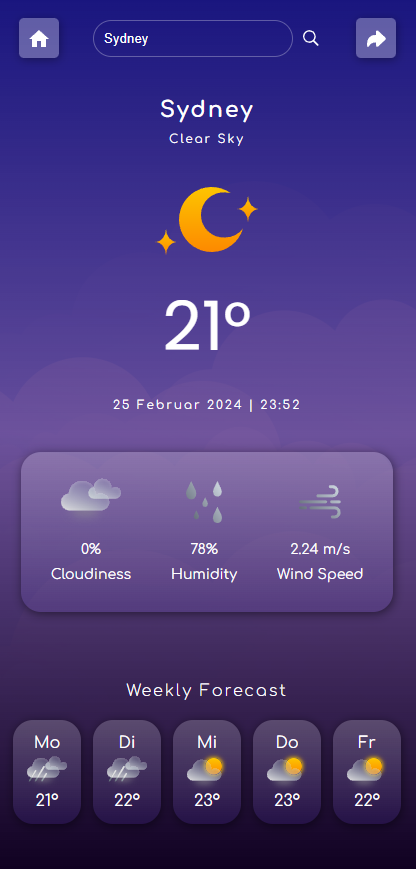

<h1 align="center"><samp>Weather App</samp> </h1>

 
  
  
  

<h3><samp>Build with:</samp></h3>
<ul>
<li><samp>HTML5</samp></li>
<li><samp>CSS</samp></li>  
</ul>

<h3><samp>Features:</samp></h3>
<ul><samp>
        <li>A mobile application providing real-time weather information.</li>
        <li>Users can enter any city to view its weather data. Default City will be the users city.</li>
        <li>Weather data is fetched from OpenWeatherMap API</li>
        <li>Displays the weather conditions for the current day.</li>
        <li>Provides a weather forecast for the next five days.</li>
</samp> </ul>

<h2><samp>Screenshot</samp></h2>

  

 

